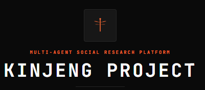

<p align="center">
  
</p>

<p align="center"><strong>Platform Simulasi Multi-Agent untuk Riset Sosial</strong></p>

KINJENG_PROJECT adalah platform simulasi sosial berbasis AI. Pengguna dapat mengunggah dokumen, kemudian sistem akan menciptakan agen-agen virtual yang memiliki kepribadian, ingatan, dan pola pikir masing-masing. Agen-agen ini akan berinteraksi, berdiskusi, dan berdebat satu sama lain — layaknya masyarakat nyata. Hasil simulasi dapat dilihat dalam bentuk grafik, statistik, dan laporan PDF.

Alur kerjanya: **unggah data → AI menciptakan masyarakat digital → agen berinteraksi → hasil siap dianalisis.**

## Filosofi

**Kinjeng** (capung dalam bahasa Jawa) memiliki empat sifat yang menjadi fondasi proyek ini:

1. **Mata Majemuk** — Capung dapat melihat hampir 360° dengan presisi tinggi. Seperti itulah AI dalam platform ini: mampu mengamati dan memetakan dinamika sosial dari berbagai sudut pandang secara simultan, mengatasi keterbatasan survei manual yang sempit.

2. **Terbang Cepat & Lincah** — Capung adalah penerbang ulung: maju, mundur, melayang, bermanuver instan. Simulasi multi-agen bekerja dengan kecepatan yang sama — memangkas proses riset yang biasanya berminggu-minggu menjadi hitungan menit.

3. **Indikator Lingkungan** — Capung hanya hidup di ekosistem yang bersih dan seimbang. Platform ini menjadi alat untuk menguji "kesehatan" opini publik terhadap suatu isu atau kebijakan sebelum kebijakan tersebut diterapkan di dunia nyata.

4. **Metamorfosis** — Capung bertransformasi dari nimfa air menjadi serangga bersayap. Ini melambangkan transformasi metodologi riset: dari survei konvensional menuju simulasi berbasis kecerdasan buatan.

> *Menggunakan kearifan lokal nama "Kinjeng" untuk teknologi Multi-Agent Simulation menunjukkan bahwa inovasi global tetap bisa lahir dan membumi dari filosofi alam di sekitar kita.*

## Fitur

- **Simulasi Multi-Agent** — Ciptakan agen AI dengan kepribadian beragam; mereka akan berkomunikasi dan berdebat secara otomatis
- **Graf Interaksi** — Visualisasi hubungan antar agen dalam bentuk peta jaringan
- **Debat Internal** — Setiap agen memiliki perspektif berbeda (rasional, emosional, sosial, dll) yang berdebat sebelum mengambil keputusan
- **Statistik & Laporan** — Hasil simulasi diolah menjadi tabel, grafik, dan laporan PDF
- **5 Jenis Simulasi** — Akademik, Politik, Pasar, Sosial, atau Kustom

## Tech Stack

| Stack | Teknologi |
|-------|-----------|
| Frontend | Vue 3 + Vite + D3.js |
| Backend | Python Flask + Gunicorn |
| Database | SQLite |
| Graph | Zep + Neo4j |

## Engine Simulasi

KINJENG_PROJECT menggunakan **[MiroFish](https://github.com/666ghj/MiroFish)** sebagai mesin simulasi multi-agent. MiroFish merupakan platform simulasi sosial berbasis AI yang telah mature dan didukung oleh **[OASIS](https://github.com/camel-ai/oasis)** dari CAMEL-AI untuk simulasi interaksi agen di platform sosial.

### TribeV2 Integration — Per-Agent Cognitive Identity

Sistem identitas agen di KINJENG_PROJECT terinspirasi dari **[TRIBE v2](https://github.com/facebookresearch/tribev2)** (Meta FAIR, 2026), sebuah multimodal foundation model yang memprediksi aktivitas fMRI otak manusia dari stimulus video/audio/teks. Konsep kunci yang diadopsi:

| Konsep TribeV2 | Implementasi di KINJENG_PROJECT |
|----------------|----------------------------------|
| **SubjectLayers** — setiap subjek fMRI punya linear layer unik yang memetakan shared brain representation ke output spesifik | **AgentIdentitySignature** — setiap agen punya vektor identitas 15+ dimensi (MBTI, cognitive style, education, knowledge, IQ, opinion bias) yang memodulasi semua respons |
| **Typicality** — seberapa "standar" aktivasi otak seseorang vs rata-rata populasi | Setiap agen punya skor *typicality*: agen dengan kepribadian tertentu (e.g. Neuroticism tinggi) menghasilkan respons lebih idiosinkratik |
| **Multimodal feature extraction** — LLaMA 3.2 (text), V-JEPA2 (video), Wav2Vec-BERT (audio) | *Processing modality* — agen visual vs verbal punya preferensi cara berpikir berbeda, terinspirasi dari riset Kraemer et al. (2009) |

Selain TribeV2, sistem ini juga didasarkan pada riset neuroscience terkini:
- **Personality → Brain typicality**: Neuroticism/Harm Avoidance → lower brain typicality (Krauss et al., 2024-2025)
- **Cognitive Style → Neural Pathway**: Visualizers vs Verbalizers menggunakan jalur otak berbeda untuk stimulus linguistik yang sama (Kraemer et al., 2009)
- **Hierarchical Linguistic Prediction**: Otak memprediksi kata DAN kalimat secara simultan; higher-level representations diupdate hanya di sentence boundaries (Communications Biology, 2025)
- **Reading Experience → Neural Individuality**: Semakin banyak pengalaman membaca, semakin idiosinkratik pola otak saat membaca teks ekspositori (PMC, 2025)

Detail implementasi: `backend/app/services/agent_identity.py`

## Development

```bash
# Backend
cd backend
pip install -r requirements.txt
python run.py

# Frontend
cd frontend
npm install
npm run dev
```

## Deploy

Deployed on Railway: `https://mirofish-production-c68d.up.railway.app`

---

*Dibuat untuk #JuaraVibeCoding 2026 — Engine simulasi oleh [MiroFish](https://github.com/666ghj/MiroFish)*
